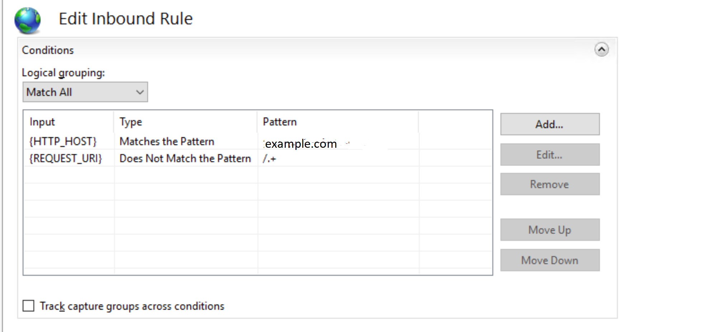
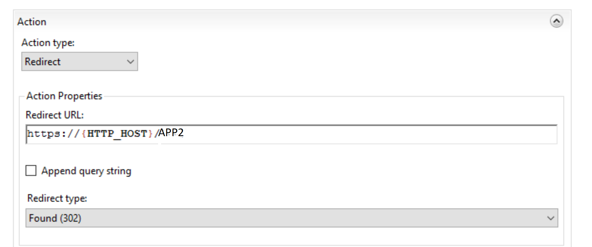

# URL rewrite to default app

```
 <rule name="redirect to b.dll" stopProcessing="true">
                    <match url="(.*)" />
                    <conditions>
                        <add input="{HTTP_HOST}" pattern="www.mysite.com" />
                        <add input="{REQUEST_URI}" pattern="/.+" negate="true" />
                    </conditions>
                    <action type="Redirect" url="https://{HTTP_HOST}/a/b.dll" appendQueryString="false" redirectType="Temporary" />
                </rule>
                
```




 - https://blog.elmah.io/web-config-redirects-with-rewrite-rules-https-www-and-more/

 - http://docs.imis.com/20.1.19/index.htm#!redirectingtotheurlofthevirtualdirectory1.htm
